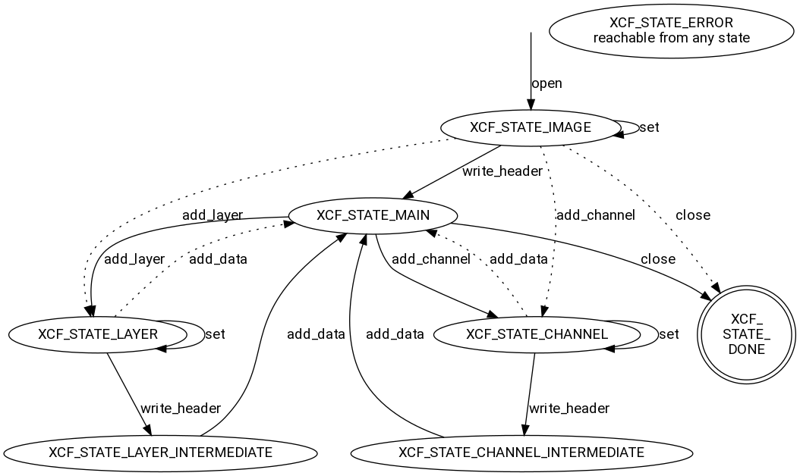

# libxcf

libxcf is a small stand alone library for writing [GIMP](https://gimp.org/) XCF files. Reading of XCF files is not in the scope right now. Rendering will never be.

## Design goals

- lightweight: have as little external dependencies as possible.
- easy to use: you shouldn't need to read a ton of documentation in order to get started.
- portable: only use standard C.
- use little system resources: files are written on the fly so the memory footprint should be as low as possible.
- permissive license: allow usage both in free as well as in closed source software so more people are able to generate images for use in GIMP. No code from GIMP was used in libxcf for that reason.

## Limitations

- Currently only writing is supported, reading might maybe be added some day, but it is really low priority.
- Not all features of XCF are supported, most notably:
  - no indexed images
  - no layer masks
  - no layer groups
  - no RLE for compression
- As files are written on the fly, so you need to know the image level settings like version and number of layers and channels in advance.
- The library jumps around in the file using `fseek` and `ftell`, so not all file systems and devices are supported.
- Currently libxcf uses `htobe{16,32,64}` from `endian.h` which is not portable.

## Dependencies

- CMake, at least version 3.9
- a C compiler (tested with gcc and clang)
- libz

If you don't want to use CMake it should be straight forward to add the files to whatever you use instead.

## Building

You can either build the library as a stand alone lib or copy it into your source tree and add it as a sub directory to your CMake project. The latter is preferred as long as the API is not considered stable. Also there is no install target yet ...

### CMake sub directory

- Clone or copy the sources to your source tree
- In your project's CMakeLists.txt add
   ```
   add_subdirectory(libxcf)
   target_link_libraries(your_executable PRIVATE xcf)
   ```

### stand alone

```
$ git clone ...
$ cd libxcf
$ mkdir build
$ cd build
$ cmake ..
$ make
```

This should leave you with a static library in `libxcf.a`.

## Usage

The API is somewhat inspired by libtiff in the sense that you open an XCF file, set properties and add data and close it in the end.

The XCF file is always in some specific internal state, depending on which you can set some things. The basic control flow is
1. create the image
2. set everything at image level
3. create layer or channel
4. set everything at the layer/channel level
5. add pixel data
6. go to 3 until all layers and channels were added
7. close the image



### The functions to do so are:

- `XCF *xcf_open(const char *filename)`
  Creates a new XCF document or returns NULL when there was an error.

- `int xcf_close(XCF *xcf)`
  Writes outstanding data and closes the file. Always call it when you are done!

- `int xcf_set(XCF *xcf, xcf_field_t field, ...)`
  Depending on what state the image is in, this function sets stuff for the current image, layer or channel.

  Available `field`s are:
  - `XCF_WIDTH` – width of image or layer
  - `XCF_HEIGHT` – height of image or layer
  - `XCF_PROP` – a property of image, layer or channel
  - `XCF_NAME` - name of layer or channel

  Fields that only exist on the image level:

  - `XCF_VERSION` – XCF version of the image. Make sure that all the features you use are supported. Otherwise the library will tell you.
  - `XCF_BASE_TYPE` – Whether the image is RGB, grayscale or indexed (the latter is not supported)
  - `XCF_PRECISION` – 8, 16, 32 or 64 bit? Linear or with gamma encoding?
  - `XCF_N_LAYERS` – Number of layers. Make sure to add the same number of layers as you specify here
  - `XCF_N_CHANNELS` – Number of channels. As with layers, this must match what you actually add.
  - `XCF_OMIT_BASE_ALPHA` – The lowest layer can be written without an alpha channel. If it's fully opaque you can safe s little disk space this way.

  With the exception of `XCF_PROP`, all of these fields take one argument.

  When setting properties, the first extra argument is the enum describing the property, and then its value(s).

  When setting a parasite property, the extra arguments are:
  - `XCF_PROP_PARASITE` – indicate that it's a parasite
  - `char *name` – the name of the parasite
  - `uint32_t flags` – parasite flags, `XCF_PARASITE_PERSISTENT` and/or `XCF_PARASITE_UNDOABLE`
  - `uint32_t length` – the length of the payload in bytes
  - `uint8_t *payload` – pointer to `length` bytes of data

  For a list of supported properties and enums for fields and properties, have a look at the code.

- `int xcf_add_layer(XCF *xcf)`
  Adds a new layer to the file.

- `int xcf_add_channel(XCF *xcf)`
  Adds a new channel to the file.

- `int xcf_add_data(XCF *xcf, const void *data, const int data_channels)`
  Add pixel data to the current layer or channel.
  - `data` – pointer to the pixel data. The layout depends on the type, for RGB layers it is R, G, B and potentially A per pixel, one after the other, with a stride equal to the width. For grayscale layers or channels it is one value and potentially A per pixel. Indexed images are not supported at the moment.
  - `data_channels` – the number of channels in the data you are passing in. For convenience this doesn't have to match the target type. If your data has more than required (for example, passing an RGBA buffer to an RGB base layer), then the extra channels are ignored. If passing in less channels than required, the missing data will be filled with black (`0` or `0.0`), except for the last one, which will be set to white (`255` or `1.0`). Keep in mind that all layers have an alpha channel (except for the base layer when configured accordingly), so when passing in 4 channels for an RGB image will actually use the 4th channel!

All functions return `0` on error.

By default a version 12 file with ZLIB compression will be generated.

## Example

For ease of reading almost all error handling was omitted.

``` lang=C
#include "xcf.h"

void write_image(const char *filename,
                 const float *data,
                 const int width,
                 const int height,
                 const int channels)
{
  XCF *xcf = xcf_open(filename);

  if(!xcf)
  {
    fprintf(stderr, "error: can't open '%s'\n", filename);
    return;
  }

  // we have created the file but didn't add a layer or channel yet.
  // this is the time for setting image level things
  xcf_set(xcf, XCF_BASE_TYPE, XCF_BASE_TYPE_RGB);
  xcf_set(xcf, XCF_WIDTH, width);
  xcf_set(xcf, XCF_HEIGHT, height);
  xcf_set(xcf, XCF_PRECISION, XCF_PRECISION_F_32_L);
  xcf_set(xcf, XCF_N_LAYERS, 1);

  // set a property
  xcf_set(xcf, XCF_PROP, XCF_PROP_COMPRESSION, XCF_PROP_COMPRESSION_NONE);

  // when setting parasites make sure to pass the
  // correct size, including the '\0' for strings!
  const char *comment = "this file was generated by libxcf";
  xcf_set(xcf,
          XCF_PROP,                // the field to set
          XCF_PROP_PARASITES,      // it's a parasite
          "gimp-comment",          // name of the parasite
          XCF_PARASITE_PERSISTENT, // parasite flags
          strlen(comment) + 1,     // size of payload
          comment);                // pointer to payload

  // add the layer and then change settings on the layer level
  xcf_add_layer(xcf);
  xcf_set(xcf, XCF_WIDTH, width);
  xcf_set(xcf, XCF_HEIGHT, height);
  xcf_set(xcf, XCF_NAME, "base layer");
  xcf_add_data(xcf, data, channels);

  // done
  xcf_close(xcf);
}
```
